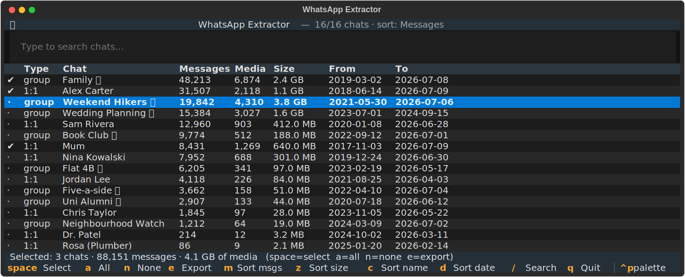

# WhatsApp Extractor

Pick the WhatsApp chats you care about from an iPhone backup — and export just
those, **with emoji reactions**, to HTML or JSON.

<p align="center">
  
</p>

Point it at a Finder/iTunes backup and it lists every chat with its stats —
message count, media count and size, date range, 1:1 or group — in a sortable,
searchable terminal UI. Select what you want and export. Only the selected
chats' media is decrypted and copied, so exporting two chats out of four
hundred is genuinely fast and small, not a full-backup dump you filter
afterwards.

## Why

A WhatsApp backup usually holds hundreds of chats and tens of gigabytes of
media, but the conversations you actually want to keep are often just a
handful. This tool puts selection first: see the stats, pick the chats, and
pay only for what you picked. It also decodes emoji reactions — which on iOS
live in a protobuf blob that takes extra work to read — so the export looks
like the conversation actually did.

## Install & run

Requires Python ≥ 3.10 and [uv](https://docs.astral.sh/uv/).

```sh
git clone https://github.com/barknktc/whatsapp-extractor
cd whatsapp-extractor
uv run whatsapp-extractor /path/to/backup-folder
```

Or without cloning:

```sh
uvx --from git+https://github.com/barknktc/whatsapp-extractor whatsapp-extractor /path/to/backup-folder
```

The backup folder is the directory containing `Manifest.db` and
`Manifest.plist`.

### Getting an iPhone backup

The tool reads a local iPhone backup — the kind Finder or iTunes makes on your
computer (not an iCloud backup, and not the phone itself).

- **macOS**: connect the iPhone, open **Finder** → select the device → choose
  *Back up all of the data on your iPhone to this Mac* → **Back Up Now**.
  Backups land in `~/Library/Application Support/MobileSync/Backup/<device-id>`.
- **Windows**: use iTunes (or the Apple Devices app) → device → **Back Up Now**.
  Backups land in `%APPDATA%\Apple Computer\MobileSync\Backup\<device-id>`.

Both encrypted and unencrypted backups work — if the backup is encrypted,
you'll be prompted for its password.

## Usage

Running with just a backup path opens the interactive picker:

```sh
uv run whatsapp-extractor /path/to/backup-folder
```

| Key | Action |
|---|---|
| `space` | Select / deselect chat |
| `a` / `n` | Select all / none |
| `/` | Search by name |
| `m` `z` `c` `d` | Sort by messages / size / name / date |
| `e` | Export selection |
| `q` | Quit |

A footer shows the running total of your selection — chats, messages, and
estimated media size — before you commit to anything.

For scripting, there's a headless path too:

```sh
# Print the per-chat stats table and exit
uv run whatsapp-extractor /path/to/backup --stats

# Export specific chats by JID, skipping the picker
uv run whatsapp-extractor /path/to/backup --export 123@s.whatsapp.net 456@g.us -o my-export --json
```

Output is HTML by default (media linked, reactions rendered); add `--json` for
a `result.json` alongside, or `--no-html --json` for JSON only.

## Privacy

Your chats never leave your machine. The tool makes no network requests:
decryption, stats, and export all happen locally. Decrypted working data (the
chat database, then the selected media) lives in a temporary workdir that is
deleted on exit — the only thing left on disk is the export you explicitly
asked for, in the folder you chose. (`--keep-workdir` disables the cleanup,
for debugging.)

## Status & limitations

Young but working — built and verified against real backups.

- **v1 scope**: 1:1 and group chats. Calls, WhatsApp Business, and Status are
  not exported.
- **iPhone backups only** — no Android, no live-device reading, no iCloud.

Design notes live in [CONTEXT.md](CONTEXT.md) (vocabulary),
[docs/DESIGN.md](docs/DESIGN.md) (architecture and findings), and
[docs/adr/](docs/adr/) (decisions).

## Credits

Built on a vendored copy of
[KnugiHK/WhatsApp-Chat-Exporter](https://github.com/KnugiHK/WhatsApp-Chat-Exporter)
(MIT) for schema parsing and HTML/JSON export — see
`src/Whatsapp_Chat_Exporter/LICENSE`. The iOS reaction decoder is informed by
[damleborgne/whatsapp-conversation-exporter](https://github.com/damleborgne/whatsapp-conversation-exporter)
(MIT).

## License

[MIT](LICENSE) © barknktc. The vendored exporter retains its own MIT license
and attribution.
